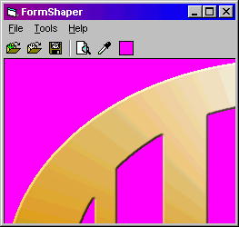



## FormShaper

### Description

Shape windows using any picture.

Generates region data faster than any other program I've seen (4 seconds as opposed to 40 for the included test.bmp)

Precompile region data beforehand using the UI, save it as a file, or put it in the resource. Use the cRegion class to apply it at runtime.

Use a bmp to generate region data ahead of time, but use a JPEG in the actual program to save space.

Notes:

The UI uses my personal versions of VBAccelerator's cCommonDialog and cRegistry classes, as well as my own cMRU and modError, all included in this package.

Mel Grubb II

CyberHaus
 
### More Info
 

             |
---                |---
**Submitted On**   |2001-10-30 13:41:36
**By**             |[Mel Grubb II](https://github.com/Planet-Source-Code/PSCIndex/blob/master/ByAuthor/mel-grubb-ii.md)
**Level**          |Intermediate
**User Rating**    |5.0 (50 globes from 10 users)
**Compatibility**  |VB 6\.0
**Category**       |[Graphics](https://github.com/Planet-Source-Code/PSCIndex/blob/master/ByCategory/graphics__1-46.md)
**World**          |[Visual Basic](https://github.com/Planet-Source-Code/PSCIndex/blob/master/ByWorld/visual-basic.md)
**Archive File**   |[FormShaper3204310302001\.zip](https://github.com/Planet-Source-Code/mel-grubb-ii-formshaper__1-28524/archive/master.zip)

